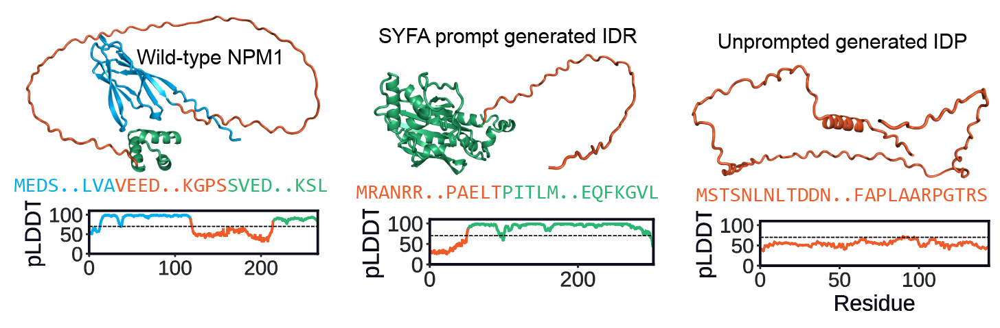

# IDiom

IDiom is a 122M parameter autoregressive transformer trained on 37M intrinsically disordered regions from the AlphaFold Database. The model can generate intrinsically disordered proteins (IDPs) as well as intrinsically disordered regions (IDRs) conditioned on their flanking context. The model can also be post-trained with reinforcement learning to optimize for custom reward functions. The associated paper can be found at: bioarxiv link

<p align="center">
  
</p>

# Table of Contents
- [IDiom](#IDiom)
- [Table of Contents](#table-of-contents)
- [Installation](#installation)
  - [Environment setup](#environment-setup)
  - [Model checkpoints and data](#model-checkpoints-and-data)
- [Generating sequences](#generating-sequences)
  - [Generating intrinsically disordered proteins](#generating-intrinsically-disordered-proteins)
  - [Generating intrinsically disordered regions](#generating-intrinsically-disordered-regions)
- [Post-training](#post-training)
  - [Custom reward functions](#custom-reward-functions)
    - [Optimizing IDP generation](#optimizing-idp-generation)
    - [Optimizing prompted IDR generation](#optimizing-prompted-idr-generation)
  - [ProtGPS reward](#protgps-reward)
  - [Tracking training progress using Tensorboard](#tracking-training-progress-using-tensorboard)
  - [Generating sequences after post-training](#generating-sequences-after-post-training)
- [Pre-training](#pre-training)
- [Citation](#citation)

# Installation

## Environment setup
First, install the [uv](https://docs.astral.sh/uv/) package manager if not already installed:

```bash
curl -LsSf https://astral.sh/uv/install.sh | sh
```

Next, clone the IDiom repository into a directory with at least 30 GB of free space and install the dependencies:

```bash
git clone https://github.com/rotskoff-group/idiom.git
cd idiom
uv sync
uv pip install -e .
```


## Model checkpoints and data

Next, download the `IDiom` model checkpoints from the HuggingFace repository into the project root directory.

**Model checkpoints**: https://huggingface.co/jxliu2/idiom

You can do so with the following commands. From the root of the cloned `IDiom` directory, do: 

```bash
# Download models (26 GB)
# Execute from IDiom root directory:
hf download jxliu2/idiom --local-dir ./models
```

Additional datasets which are NOT necessary for running this code repository can be found in the following HuggingFace repository: https://huggingface.co/datasets/jxliu2/idiom-datasets

This includes the 37M IDRs used to pre-train `IDiom` as well as the generated sequences which we analyze in our paper. To download this OPTIONAL data, use the following command to download the entire dataset or manually download specific files of interest from the HuggingFace URL. 

```bash
# OPTIONALLY download the IDR data (174 GB):
# Execute from IDiom root directory: 
hf download jxliu2/idiom-datasets --repo-type=dataset --local-dir ./datasets

# If you only want the FASTA files containing the curated IDRs, run: 
hf download jxliu2/idiom-datasets \
  idr_datasets/training_sequences/AFDB_IDR_90_FIM_512_full.fasta \
  --repo-type=dataset \
  --local-dir ./datasets

hf download jxliu2/idiom-datasets \
  idr_datasets/training_sequences/AFDB_IDR_90_FIM_512_idrs.fasta \
  --repo-type=dataset \
  --local-dir ./datasets
```

After this, the project structure should be:

```
idiom/
|
├── src/                       # Main Python package
│   └── idiom/
│       ├── nn/                # Model architecture
│       ├── scripts/           # CLI entry points and Hydra configs
│       └── utils/             # Utilities
|
├── entrypoints/               # Scripts for training and inference
│   ├── infer/                 # Inference scripts and output
│   ├── precompute/            # Data preprocessing scripts
│   └── train/                 # Pre- and post-training scripts
|
├── rewards/                   # Reward functions and models
│   ├── custom_rewards/        # Custom reward functions
│   └── protgps/               # ProtGPS localization reward model
|
├── models/                    # Model checkpoints
|
├── assets/                    # Images
|
└── datasets/                  # Datasets (optional)
```

Now, the example bash scripts described below can be run directly using `bash` or via SLURM using `sbatch`. 


# Generating sequences

IDiom allows for the generation of unprompted intrinsically disordered proteins (IDPs) or intrinsically disordered regions (IDRs) prompted by their surrounding flanking context within a protein. We have tested inference on NVIDIA GeForce RTX 4080 GPUs with 16 GB VRAM. 


## Generating intrinsically disordered proteins

To generate unprompted IDPs, execute the `generate_idps.bash` script. 

```bash
cd entrypoints/infer/scripts
bash generate_idps.bash # or: sbatch generate_idps.bash
```

This script uses the pre-trained base model described in the paper to generate unprompted IDPs. You can specify the number of IDPs to generate by modifying the `--num_duplicates` value (default 1000) in `generate_idps.bash`. 

Generated sequences are output as FASTA files in the `entrypoints/infer/output/idps` directory. The following files will be created: 

- `tst_autoregressive.pkl` — Raw generated token sequences
- `generated_idrs.fasta` — FASTA file containing the generated disordered sequences 
- `generated_full.fasta` — Same as above, with indices of the disordered region in each sequence header header
- `inference_config.yaml` — Inference configuration file 


## Generating intrinsically disordered regions

To generate IDRs conditioned on their surrounding context, you must provide a FASTA file containing the full-length protein(s) you would like to generate IDRs within. An example file is provided at: `entrypoints/infer/scripts/example_sequences.fasta`. 

This FASTA contains two full-length protein sequences. Each sequence entry MUST have a header which ends with the string "_IDR_x-y" where x and y indicate the start and end indices (1-indexed) of the wild type IDR. For example, in the provided FASTA, the wild type IDR of the first sequence begins at 119 and ends at 242. 

```
>P06748_IDR_119-242
MEDSMDMDMSPLRPQNYLFGCELKADKDYHFKVDN...

>P09651_IDR_186-372
MSKSESPKEPEQLRKLFIGGLSFETTDESL...
```

The code automatically extracts the N-terminal prefix and C-terminal suffix to the indicated IDR and uses those as the conditioning for generation. 

To generate IDRs, execute the example bash script: 

```bash
cd entrypoints/infer/scripts
bash generate_idrs.bash # or: sbatch generate_idrs.bash
```

This script also uses the pre-trained base model described in the paper. You can specify the number of IDRs to generate by modifying the `--num_duplicates` value (default 1000) in `generate_idrs.bash`. The script will generate `num_duplicates` IDRs for each sequence provided in the FASTA file. 

Generated sequences are output as FASTA files in the `entrypoints/infer/output/idrs` directory. The following files will be created: 

- `tst_autoregressive.pkl` — Raw generated token sequences
- `generated_idrs.fasta` — Contains the generated IDR sequences
- `generated_full.fasta` — Contains the full length sequences with indices of the generated disordered region in each sequence's header
- `inference_config.yaml` — Inference configuration file 


# Post-training

Here we describe the post-training workflows that can be done with IDiom. Post-training can be done with any custom reward function, and post-training can be used to optimize the generation of either IDPs or IDRs. We have tested post-training on NVIDIA GeForce RTX 4080 GPUs with 16 GB VRAM. 

**Out-of-memory errors during training.** If you encounter GPU OOM errors during post-training, in the training submission scripts, reduce the `BATCH_SIZE` hyperparameter and increase `ACCUMULATE_GRAD_BATCHES` by the same factor to keep the effective batch size constant. This applies to all post-training workflows.

## Custom reward functions

You can define your own custom reward function in `rewards/custom_rewards/custom_rewards.py`. An example function is given: `compute_fraction_proline()`. 

This example reward function extracts the disordered region from the generated sequence and calculates the fraction of proline residues in the IDR as the reward. Reward values should be in the range 0 to 1. 

### Optimizing IDP generation 

To run post-training with this example reward function on generated unprompted IDPs, execute this script: 

```bash
bash entrypoints/train/post-train/train_rl_idp_custom.bash # or sbatch 
```

When you define your own custom reward function in `custom_rewards.py`, the function must begin with "compute_". Then, you should modify the configuration parameter `reward_function_name` in the bash script to be your function's name. 

### Optimizing prompted IDR generation 

To optimize the generation of IDRs prompted with flanking context, you must provide a FASTA file containing a single protein sequence. Again, this sequence's header MUST have a header which ends with the string "_IDR_x-y" where x and y indicate the start and end indices (1-indexed) of the wild type IDR. 

An example sequence is provided at `entrypoints/train/post-train/rl_sequence.fasta`. To run training, execute the bash script: 

```bash
bash entrypoints/train/post-train/train_rl_idr_custom.bash # or sbatch 
```

This will use the flanking context of the IDR in the FASTA file as the prompt in generating IDRs for RL optimization. 


## ProtGPS reward

As examples, we also provide training scripts to replicate our training runs with the ProtGPS localization score as the reward. 

The script used to optimize unprompted IDPs is: 

```bash
bash entrypoints/train/post-train/train_rl_idp_protgps.bash # or sbatch 
```

And a script for optimizing prompted IDRs is: 

```bash
bash entrypoints/train/post-train/train_rl_idr_protgps.bash # or sbatch 
```

## Tracking training progress using Tensorboard 

To track progress on post-training runs, first activate the virtual environment. From the repo root:

```bash
source .venv/bin/activate 
```

Then, use Tensorboard by first navigating to the directory containing `lightning_logs` and run: 

```bash
tensorboard --logdir . 
```

## Generating sequences after post-training

To generate sequences from a post-trained model checkpoint, set the `CKPT_PATH` in `generate_idps.bash` or `generate_idrs.bash` to be the post-trained checkpoint (.ckpt) located in the lightning_log. Then run the generation script as above: 

```bash
bash entrypoints/infer/scripts/generate_idps.bash  # or generate_idrs.bash
```


# Pre-training

To replicate the model pre-training, you must first download the appropriate datasets from HuggingFace. 

**Datasets**: https://huggingface.co/datasets/jxliu2/idiom-datasets

From the repo root directory, execute: 

```bash
# Download the IDR data (174 GB):
# Execute from IDiom root directory: 
hf download jxliu2/idiom-datasets --repo-type=dataset --local-dir ./datasets
```

Then, execute the precompute to prepare the training sequences for model training. Note that at least 1 TB of space is required for the precompute. 

```bash
sbatch combined_precompute.bash 
```

Next, execute the training script: 

```bash
sbatch pretrain.bash 
```

# Citation

If you find this work useful, please cite: 

```bibtex
@article{liu2025idiom,
  author = {},
  title = {},
  journal = {bioRxiv},
  year = {2025},
  doi = {},
  URL = {},
}
```
