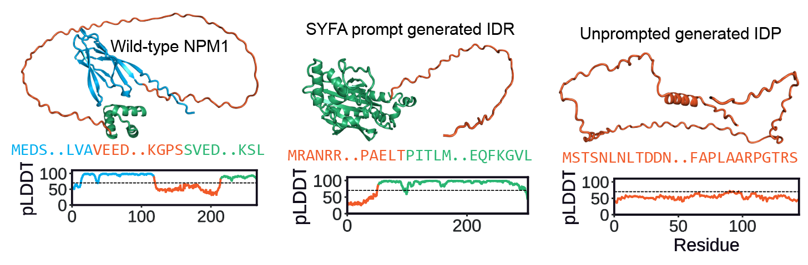

# IDiom

IDiom is an autoregressive transformer for **generating and designing intrinsically disordered
protein regions (IDRs)**. Trained on ~37M IDRs from the AlphaFold Database with a
fill-in-the-middle objective, it generates fully disordered proteins (IDPs) de novo, or IDRs
conditioned on their flanking structured context, and can be post-trained with reinforcement
learning to optimize custom rewards. Sparse autoencoders (SAEs) on its residual stream make the
learned features interpretable and steerable.

Preprint: [Generative design of intrinsically disordered protein regions with IDiom](https://doi.org/10.64898/2026.04.10.717777)



## Install

```bash
# directly from GitHub:
pip install git+https://github.com/rotskoff-group/idiom.git

# or from source (for training / reproduction):
git clone https://github.com/rotskoff-group/idiom.git && cd idiom && uv sync && uv pip install -e .
```

## Quickstart

```python
from idiom import IDiom

model = IDiom.from_pretrained("jxliu2/idiom-medium")     # downloads weights from HF

# de-novo IDPs
idrs = model.generate_idp(n=100, temperature=1.0)

# IDRs conditioned on flanking context (0-based, half-open coords)
idrs = model.generate_idr(protein_seq, idr_start, idr_end, n=100)

# residual-stream embeddings for downstream tasks
emb = model.embed("proteins.fasta", layers=[8], pool="mean")
```

Interpret and steer with a sparse autoencoder (`IDiomSAE` bundles the SAE with its host model and
layer, so it always runs on the distribution it was trained on):

```python
from idiom import IDiomSAE

sae   = IDiomSAE.from_pretrained("jxliu2/idiom-medium-sae-L8")   # host model auto-loaded
feats = sae.encode("proteins.fasta")                  # per-sequence feature activations
seqs  = sae.steer_generate(feature=1234, strength=0.5, n=100)    # feature-steered generation
fid   = sae.fidelity("records.fasta")                 # substitution-loss fraction recovered
```

FASTA-first from the command line:

```bash
idiom_generate idp --model jxliu2/idiom-medium --n 1000 --out idps.fasta

idiom_generate idr --model jxliu2/idiom-medium --fasta proteins.fasta --n 1000 --out idrs.fasta
# For IDR generation, input headers must specify the IDR region, ending with _IDR_x-y (1-based, inclusive), e.g. >P06748_IDR_119-242
```

## Models & data (HuggingFace)

Weights and datasets are hosted on the Hub, not in this repo:

(Models to be uploaded soon)

- `jxliu2/idiom-medium`, `jxliu2/idiom-large` — base models (`from_pretrained`)
- `jxliu2/idiom-rl` — per-compartment RL-post-trained checkpoints
- `jxliu2/idiom-medium-sae-L8` — sparse autoencoders, one repo per host model + layer
- `jxliu2/idiom-datasets` — curated IDR corpus, generated sequences, feature datasets, eval sets

## Repository layout

Only `src/idiom/` ships in the pip package; the rest is clone-only.

| Path | Role |
|------|------|
| `src/idiom/` | the library: `data` (tokenizer/FIM/dataset), `model` (transformer + KV cache + sampling), `train` (pretrain/SFT/GRPO), `sae` (SAEs + interpretability), `utils` (device, perplexity), public `IDiom` API |
| `assets/` | static assets (figures for docs) |
| `rewards/` | GRPO reward definitions + the vendored ProtGPS reward model |
| `tests/` | unit/integration tests for the library |

## Training / interpretability (CLIs)

| Command | Does |
|---------|------|
| `idiom_train` | pretrain (and SFT via `--config-name sft`) |
| `idiom_grpo` | GRPO/ProtGPS post-training |
| `idiom_sae` | train a top-k SAE on a layer (streaming activations) |
| `idiom_feature_dataset` | build the per-residue SAE feature dataset |
| `idiom_extract` | export residual-stream embeddings from a FASTA |
| `idiom_build_store` | build a memory-mapped record store from a record FASTA |
| `idiom_generate` | FASTA-first generation (inference) |

Configs are flat Hydra YAMLs (`src/idiom/configs/`), overridden on the CLI; each config's header
comment shows a representative invocation. Example:

```bash
idiom_sae model_ckpt=/path/model.ckpt data.fasta=/path/records.fasta layer=8 sae.k=32
```

## Citation

```bibtex
@article{liu2026idiom,
  author = {Liu, Jason and Ibarraran, Sebastian and Hu, Frank and Park, Abigail and Dunn, Alexander and Rotskoff, Grant},
  title = {Generative design of intrinsically disordered protein regions with {IDiom}},
  journal = {bioRxiv},
  year = {2026},
  doi = {10.64898/2026.04.10.717777},
  URL = {https://doi.org/10.64898/2026.04.10.717777},
}
```
